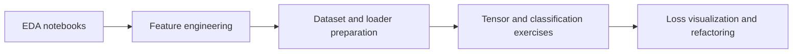

# Apple Optimized Battery Charging

Coursework and notebook exercises exploring data preparation, feature engineering, and neural-network classification for optimized battery charging.

  

## Overview

The repository is organized as a sequence of notebooks and supporting helpers covering exploratory analysis through model development. The folders include:

- `EDA` — exploratory analysis exercises.
- `Feature_Engineering` — battery-data feature engineering.
- `DataLoaders_Part_One` and `Dataset_Model_Prep_Final` — dataset and loader preparation.
- `Defining_Dataset_Ex` and `Working_With_Tensors` — introductory dataset and tensor work.
- `Classification_Model`, `NN_Solution`, and `Refactor_Activity_Classification` — classification-model exercises and solutions.
- `Loss_Vis_Ex` — loss visualization, with `helpers.py` support.

## Preview

## Data references

- [AI Education Battery Charging dataset](https://trove.apple.com/dataset/aiedu_battery_charging/1.0.0)
- [Run/Walk Motion dataset](https://trove.apple.com/dataset/run_walk_motion/1.0.0)

## Usage

Open the notebooks in their numbered or descriptive folders with Jupyter. Run them with the data and helper files expected by each notebook.

## Status

This is a collection of course exercises. The repository does not include a root dependency manifest or automated test suite.

> [!TIP]
> Start with the exploratory-analysis and feature-engineering notebooks before the classification exercises; each folder documents a distinct stage of the course sequence.

## Notebook progression

